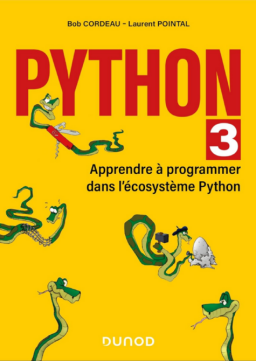

# Python 3 – Apprendre à Programmer dans l'écosystème Python

**Travail en cours** — Les liens ci-dessous référencent l'édition précédente du livre.

Contenu en ligne pour le livre [Apprendre à Programmer avec Python 3](https://www.dunod.com/sciences-techniques/python-3-apprendre-programmer-en-python-avec-pyzo-et-jupyter-notebook) de B.Cordeau et L.Pointal, aux éditiond Dunod ([ISBN:978-2-10-076636-9](https://www.lalibrairie.com/livres/python-3--apprendre-a-programmer-en-python-avec-pyzo-et-jupyter-notebook_0-4184158_9782100766369.html))

[Sommaire du livre](#user-content-sommaire-du-livre)

Le fichier [Errata_2020_de_python_3.pdf](https://github.com/lpointal/appbclp/raw/master/Errata_2020_de_python_3.pdf]) contient les correctifs pour les lecteurs possédans le premier tirage de la **seconde version** de l'ouvrage.

Le fichier [Errata_2018_de_Python_3.pdf](https://github.com/lpointal/appbclp/raw/master/Errata_2018_de_Python_3.pdf) contient les correctifs pour les lecteurs possédant le premier tirage de la **première version** de l'ouvrage.

## Documentation

Dans ``documentation/``, les versions PDF du Mémento Python 3 ([source](https://perso.limsi.fr/pointal/python:memento)) et de l'Abrégé Dense Python 3.2 ([source](https://perso.limsi.fr/pointal/python:abrege)), ainsi qu'une petite note concernant l'utilisation de Jupyter pour faire fonctionner les exercices.

## Applications

Dans ``applications/``, les programmes Python 3 du livre, utilisés pour présenter les concepts, et pour lesquels des explications détaillées sont données dans les sections concernées :

- Chapitre 1, carte de France des 200 commune les moins densément peuplées.

    Pour exécuter le script ``carto.py``, il faut mettre en place un environnement conda ad-hoc (version de Python et librairies nécessaires) et télécharger les données comme indiqué dans le script.

- Chapitre 7, requêtes SQL en Python.

    Le script ``notesinitdb.py`` se charge de mettre en place les données dans la base afin de pouvoir effectuer les requêtes. Pour cela, il utilise les fichiers ``controls.csv`` et ``eleves.csv``.
    Le script ``notesrequetes.py`` présente une série de requêtes pour extraire et manipuler les données.

- Chapitre 7, micro serveur web.

    Pour exécuter le script ``nouveautesdunod.py``, il faut mettre en place un environnement conda avec les librairies indiquées.

- Chapitre 9, application gestion de répertoire avec interface graphique.

    Les scripts ``tkPhone_IHM.py`` et ``tkPhone.py``, ainsi que le fichier tkphone.txt contenant quelques données d'exemple.

- Chapitre 11, transformation géométrique d'une image.

    Le script ``pythoon.py`` ainsi que l'image `pythoon.png`.

## Exercices

Les exercices sont organisés en deux séries de [Notebooks Jupyter](https://jupyter.org/), l'une contenant les énoncés et permettant de chercher à résoudre les exercices, l'autre reprenant les énoncés avec des exemples de correction, regroupés par chapitre du livre.

### Mise en œuvre

Voici une solution pour mettre en œuvre les exercices sur votre ordinateur personnel :

1. Télécharger l'archive compressée [appbclp-master.zip][archive] qui contient les fichiers de ce projet GitHub, et la décompresser dans un répertoire (``appbclp-master``).

1. Si ce n'est pas déjà fait, installer miniconda ([doc du livre][doclivre], [doc miniconda][docmini] *en anglais*), actuellement avec Python 3.7.

1. Créer un environnement conda pour les exercides,  l'activer et y installer les paquets nécessaires :

        conda create -n exospython python=3.7
        conda activate exospython
        conda install jupyter
        conda install numpy matplotlib

1. Fixer un mot de passe pour Jupyter :

        jupyter notebook password
        # …Saisie du mot de passe

1. Changer le répertoire courant vers ``appbclp-master`` qui contient les exercices et lancer Jupyter, le serveur de notebooks  :

        jupyter notebook

1. Si votre butineur web ne s'est pas ouvert automatiquement, l'ouvrir avec l'adresse locale [http://localhost:8888/login][urllogin], se connecter en utilisant le mot de pase, puis sélectionner le Notebook ``navigation.ipynb``.

*Note : pensez à mémoriser le mot de passe. Si vous le perdez vous pouvez en mettre en place un nouveau en re-exécutant la commande ``jupyter notebook password``.*

*Note : si vous avez opté pour Anaconda, Jupyter a normalement été automatiquement installé, ainsi que les paquets scientifiques.*

[archive]: https://github.com/lpointal/appbclp/archive/master.zip
[doclivre]: https://perso.limsi.fr/pointal/python:installation:accueil
[docmini]: https://docs.conda.io/en/latest/miniconda.html
[urllogin]: http://localhost:8888/login

### Organisation notebooks

Le fichier notebook [**navigation.ipynb**](navigation.ipynb), situé au premier niveau, permet grace à l'environnement Jupyter de naviguer vers des collections d'autres notebooks contenant les exercices et les corrections. Le répertoire ``data/``contient les données nécessaires pour les exercices.

Les exercices sont organisés en quatre notebooks par chapitre, qui permettent de travailler sur les notions présentées :

* **Exercices du livre** et **solutions**.
* **Exercices supplémentaires** (uniquement disponibles en ligne) et **solutions**.

Les exercices qui demandent de créer des modules ont leurs corrigés dans le répertoire `projets/`.

<!--  Les compléments au livre sont disponibles sur [les + en ligne sur le site Dunod](https://www.dunod.com/sciences-techniques/python-3) : -->

## Licence

**Note :** Les documents fournis ici sont sous la licence [Creative Common Attribution-ShareAlike 4.0 International (CC BY-SA 4.0)](https://creativecommons.org/licenses/by-sa/4.0/). Vous êtes autorisé à : partager (copier, distribuer et communiquer le matériel par tous moyens et sous tous formats) et adapter (remixer, transformer et créer à partir du matériel pour toute utilisation). Vous devez citer les auteurs et l'ouvrage lié et partager vos modifications sous la même licence. Voir le fichier ``LICENSE``. 

## Sommaire du livre

*  **Sommaire**
    * Préface
    * Avant-propos
    * Programmer en Python
        * Mais pourquoi donc apprendre à programmer ?
        * Mais pourquoi donc apprendre Python ?
        * Comment passer du problème au programme
        * Techniques de production des programmes
        * Résumé et thèmes de réflexion
    * La calculatrice Python
        * Modes d’exécution d’un code Python
        * Identificateurs et mots-clés
        * Notion d’expression
        * Variable et objet
        * Types de données entiers
        * Types de données flottants
        * Chaînes de caractères
        * Types binaires
        * Entrées-sorties de base
        * Comment trouver une documentation
        * Résumé et exercices
    * Contrôle du flux d’instructions
        * Indentation significative et instructions composées
        * Choisir
        * Boucles
        * Ruptures de séquences
        * Résumé et exercices
    * Conteneurs standard
        * Séquences
        * Listes
        * Tuples
        * Séquences de séquences
        * Retour sur les références
        * Tables de hash
        * Dictionnaires
        * Ensembles
        * Itérer sur les conteneurs
        * Résumé et exercices
    * Fonctions et espaces de nommage
        * Définition et syntaxe
        * Passage des arguments
        * Espaces de nommage
        * Résumé et exercices
    * Modules et packages
        * Modules
        * Packages
        * Résumé et exercices
    * Accès aux données
        * Fichiers
        * Travailler avec des fichiers et des répertoires
        * Sérialisation avec `pickle` et `json`
        * Bases de données relationnelles
        * Micro-serveur web
        * Résumé et exercices
    *  programmation orientée objet
        * Origine et évolution
        * Terminologie
        * Définition des classes et des instanciations d'objets
        * Méthodes
        * Méthodes spéciales
        * Héritage et polymorphisme
        * Notion de « conception orientée objet »
        * Résumé et exercices
    * La programmation graphique orientée objet
        * Programmes pilotés par des événements
        * Bibliothèque `tkinter`
        * Deux exemples
        * Résumé et exercices
    * Programmation avancée
        * Techniques procédurales
        * Techniques objets
        * Algorithmique
        * Résumé et exercices
    * L'écosystème Python
        * *Batteries included*
        * L'écosystème Python scientifique
        * Bibliothèques tierces
        * Documentation et tests
        * Microcontrôleur et objets connectés
        * Résumé et exercices
*  **Annexes**
    * Interlude
    * Le codage des nombres et des caractères
    * Les expressions régulières
    * Les messages d'erreur de l'interpréteur
    * Résumé de la syntaxe
*  **Bibliographie**
*  **Glossaire et lexique anglais/français**
*  **Index**

