# Installation de Python

La procédure d'installation a été mise en ligne avec de nombreuses
copies d'écran et liens — outre l'économie de papier, cela permet de
corriger lorsque des problèmes remontent ou que des évolutions modifient
les procédures
(<a href="mailto:laurent.pointal@limsi.fr?subject=Page installation Python">L.Pointal</a>).

Une page dédiée fournit une introduction à l'utilisation du
[gestionnaire conda](/python/conda/).

------------------------------------------------------------------------

> [!NOTE]
> Si vous avez l'espace nécessaire et un réseau assez rapide, l'installation de
> [Anaconda](https://www.anaconda.com/download) permet d'installer en une
> seule fois Python, matplotlib, et Spyder3 (IDE en remplacement de Pyzo).
> Une fois Anaconda installé, vous pouvez passer aux travaux pratiques…

## Éléments communs

### Version de Python

La version majeure de Python à installer est **Python 3**, en
choisissant autant que possible la toute dernière version — et dans
tous les cas **au moins Python 3.6** (pour le support des chaînes
interpolées ou *f-strings* ainsi que des annotations de typage des
variables).

Note : La dernière version majeure précédente, Python 2.7, n'est plus
maintenue depuis le 1/1/2020 ; elle est à réserver au fonctionnement
d'anciens programmes qui ne sont pas compatibles avec Python 3 et ne
devrait pas être utilisée pour développer de nouveaux programmes.

**Installation** : pour les détails, voir [Windows](#windows),
[MacOS](#mac_os) ou [Linux](#linux) suivant le système d'expoitation
que vous utilisez. Les explications ci-après permettent de comprendre
les différentes façons d'installer et les outils disponibles.

Il est possible d'installer Python à partir de la distribution standard
fournie sur le site de Python, puis de télécharger et d'installer
séparément les outils complémentaires (`matplotlib`, `numpy`…) ainsi
qu'un environnement de développement (IDE - Integrated Development
Environment) qui permet l'édition et l'exécution avec des outils
d'assistance (aide à l'édition, documentation, débogage…).

Il est aussi possible d'utiliser des installeurs qui empaquettent
Python avec de nombreux outils et/ou IDE et évitent d'avoir à réaliser
de multiples téléchargements + installation.

### Environnements de Développements Intégrés

Python fournit en standard un IDE appelé
[IDLE](https://wiki.python.org/moin/IDLE) (parfois empaqueté séparément
ou nécessitant une sélection à l'installation), assez frustre mais qui
permet tout de même de programmer avec un minimum d'assistance
([documentation IDLE (en)](https://docs.python.org/3/library/idle.html)).

> [!NOTE]
> Note : il est tout à fait possible
> d'utiliser simplement un éditeur de texte (`notepad++`, `sublimetext`,
> `kate`, `gedit`… et pour les plus aventuriers `vim` ou `emacs`),
> accompagné d'un terminal ou console pour lancer l'exécution des
> scripts.\
> *Attention, à ne pas utiliser un « traitement de texte » comme MS-Word
> ou LibreOffice, ceux-ci ne sont pas adaptés à la programmation.*

Le wiki du site python.org contient une page [Integrated Development
Environment](https://wiki.python.org/moin/IntegratedDevelopmentEnvironments).
Il est intéressant d'utiliser un des IDE dans la section « IDEs with
introspection-based code completion and integrated debugger ».

Dans les IDE open-source, citons :

- `Pyzo` ou `Thonny` plutôt dédiés à l'enseignement et faciles
    d'accès,
- `Spyder` plus dédié à une utilisation scientifique,
- `Ninja`, `PyScripter` pour un usage général,
- `Eric` pour un usage général accompagné de nombreux outils,
- `IdleX` qui reprend IDLE et l'étend.

Parmi les IDE commerciaux, certains fournissent des versions autorisant
une utilisation personnelle ou pour l'enseignement (versions
généralement allégées) :

- `WingIDE` dans ses versions 101 et Personal,
- `PyCharm` dans sa version Community,
- `Komodo` dans sa version Edit.

Il existe aussi des intégrations de Python dans des IDE plus généraux
comme `Eclipse`, `VS Code`, `VisualStudio`, `NetBeans` ou `KDevelop`.

Un plus pour [PyCharm](https://www.jetbrains.com/pycharm/download/) qui
permet, grâce aux annotations spécifiant les types (variables,
paramètres, valeurs de retour…) d'indiquer de possibles erreurs lors
de l'édition.

> [!NOTE]
> Choix en **Mesures Physiques à l'IUT d'Orsay** : pour les TPs, 
> l'IDE **Pyzo** est installé (il dispose
> d'une traduction de son interface en Français, contrairement à thonny
> — par contre celui-ci a des fonctionnalités sympathiques concernant le
> suivi des variables et de l'évaluation des expressions lors du débogage
> pas à pas, si l'anglais ne vous rebute pas ça peut être un bon choix
> pour chez vous, ou sinon le plus professionnel PyCharm).

### Distributions avec installeurs complets

Souvent créés par des sociétés qui fournissent du service autour de
Python (très souvent dans le monde de la technologie et/ou de la
science), ils permettent d'installer le langage Python, des librairies
supplémentaires, des environnements de développements, sans avoir à les
récupérer séparément et à les recompiler (cette dernière étape pouvant
se révéler plutôt difficile dans certains cas).\
Ils fournissent généralement le support d'*environnements virtuels*,
c'est à dire la possibilité d'avoir plusieurs installations de Python
en parallèle, avec chacune son lot distinct de librairies dans des
versions sélectionnées, et qui ne se parasitent pas les unes les autres
(utile lorsqu'on travaille sur différents projets).

Le wiki du site python.org contient une page 
[Python Distributions](https://wiki.python.org/moin/PythonDistributions).

On peut noter :

- Par Continuum Analytics :
  [Anaconda](https://store.continuum.io/cshop/anaconda/)
- Par Active State :
  [ActivePython](https://www.activestate.com/products/activepython/)
- Par Entought : [Canopy](https://www.enthought.com/product/canopy/)
- La distribution communautaire libre
  [PythonXY](https://python-xy.github.io/)

> [!IMPORTANT]
> Ces distributions peuvent être volumineuses (jusqu'à plusieurs Go). 
> Si vous ne disposez pas d'une
> bonne connexion à Internet, essayer de les récupérer entièrement sur une
> clé USB puis de les installer à partir de celle-ci (lorsque
> l'installeur le permet), ou sinon choisir une alternative plus réduite
> — par exemple il existe une version réduite de Anaconda dans la
> distribution [Miniconda](https://conda.io/miniconda.html), qui installe
> le minimum et permet d'ajouter ensuite uniquement les éléments dont on
> a besoin — c'est utile aussi si on est limité en place sur le disque
> dur.

### C'est quoi le PATH et les variables d'environnement

Les **variables d'environnement** sont des données qui sont fournies
aux programmes lorsqu'ils démarrent (elles constituent
l'*environnement* du programme pour son exécution), sous la forme de
noms associés à des valeurs textuelles. Avec une console, vous pouvez
les afficher sous Linux ou MacOS avec la commande `env`, et sous Windows
avec la commande `set` (ou avec PowerShell `Get-ChildItem Env:`).

Le **PATH** est une variable d'environnement qui liste un ensemble de
répertoires dans lesquels sont recherchés les programmes et commandes à
exécuter. Il est utilisé par le *shell* (interpréteur de commandes), ou
par l'environnement graphique, lorsqu'on lance un programme sans
spécifier explicitement l'endroit où il se situe. On peut l'afficher
sous Linux ou MacOS avec la commande `echo $PATH`, et sous Windows avec
la commande `path` (ou avec PowerShell `$Env.Path`).

> [!IMPORTANT]
> Du **danger de mettre votre Python prioritaire dans le PATH**…
> entre autres sous Linux/MacOS…
> 
> Si le PATH contient une version spécifique de Python, il peut arriver
> que certains outils qui sont prévus pour fonctionner avec
> l'installation de Python standard du système se retrouvent à être
> exécutés avec cette installation spécifique.  
> Outre les problèmes avec la version de Python lui-même, il y a de forts
> risques que des librairies soient manquantes ou soient installées dans
> de mauvaises versions.
> 
> Il vaut donc mieux mettre en place des **environnements virtuels
> Python**, soit [avec
> conda](https://conda.io/docs/user-guide/tasks/manage-environments.html),
> soit [avec virtualenv](https://virtualenv.pypa.io/en/latest/) (et
> [virtualenvwrapper](https://virtualenvwrapper.readthedocs.io/en/latest/index.html))
> ([article Sam&Max sur virtualenv](http://sametmax.com/les-environnement-virtuels-python-virtualenv-et-virtualenvwrapper/)).
> Et ensuite activer ces environnements au besoin suivant les projets que
> l'on développe.

------------------------------------------------------------------------

## Windows

### Connaître votre système Windows

> [!NOTE]
> Nous considérons les versions 7 et 10 de Windows (les plus répandues).  
> Note: Si vous utilisez une version de Windows XP, Vista, 7 ou 8, il est
> fortement recommandé de faire une mise à jour vers Windows 10 si c'est
> possible (techniquement et financièrement) ou sinon de passer à Linux
> (par exemple avec la distribution
> [Ubuntu](https://ubuntu-fr.org/telechargement)) car ces anciennes
> versions de Windows ne reçoivent plus de mise à jour et vous exposent à
> des risques de piratage de votre ordinateur. \</WRAP\>

Une solution pour connaître la version de Windows que vous utilisez :

1. Ouvez un explorateur de fichiers (raccourci Windows-E).
2. Clic droit sur *Ordinateur* pour ouvrir le menu contextuel.
3. Menu contextuel *Propriétés*.
4. Accès à la fenêtre *Informations système générales*.

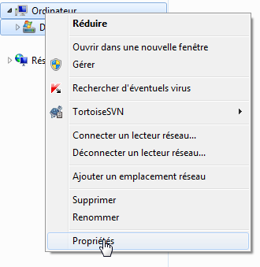

Vous pouvez aussi accéder à la fenêtre *Informations système générales*
en passant par le *Panneau de Configuration* → *Système et sécurité* →
*Système* → *Afficher la quantité de mémoire RAM et la vitesse du
processeur* :

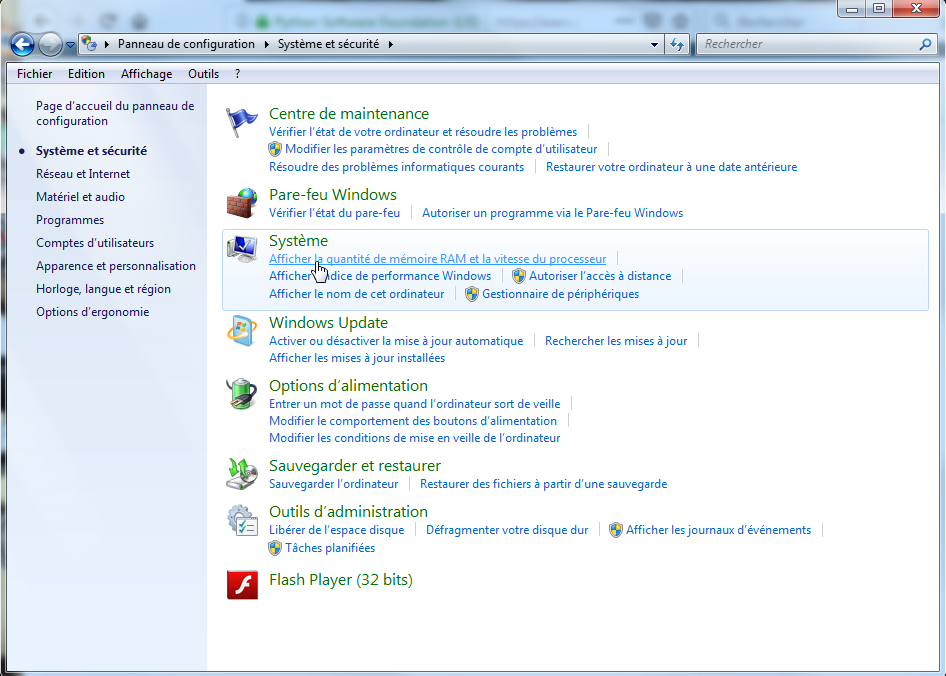

La fenêtre **Informations système générales** vous indique la version de
Windows (*Édition Windows* : 7 ou 10 ou…) ainsi que sa déclinaison
(*Type du système* : 32 bits ou 64 bits). Notez ces informations.

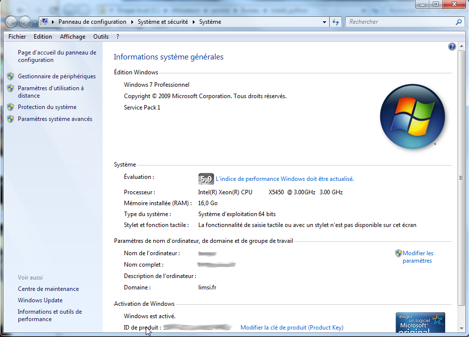

### Réglages annexes, astuces

Au niveau du gestionnaire de fichiers de Windows, il est généralement
bien de corriger les réglages par défaut pour l'affichage :

**Afficher systématiquement les extensions des fichiers** (cela permet
d'éviter d'ouvrir un programme exécutable `.exe` d'un fichier
`monimage.png` qui s'appelle en vérité `monimage.png.exe`) : Décocher
l'option «Masquer les extensions des fichiers dont le type est connu».

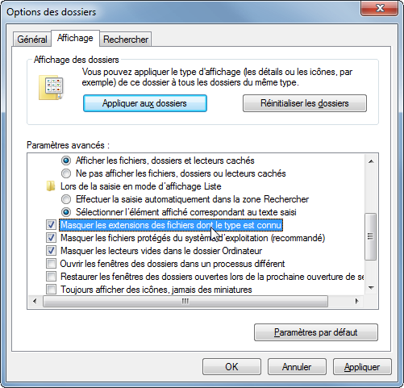

**Afficher les fichiers cachés** (surtout sous Windows 7 où le
changement affichés/cachés pour ce genre de fichiers n'est pas direct -
sauf à installer [Classic Shell](http://www.classicshell.net/)) :
Choisir l'option «Afficher les fichiers, dossiers et lecteurs cachés».

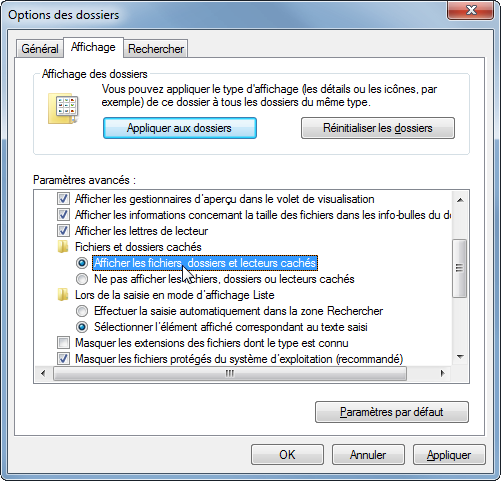

Note : sous Windows 10 une commande du ruban permet de masquer/afficher
simplement les fichiers cachés.

Certains fichiers sont en effet installés dans votre répertoire
personnel, mais dans des répertoires normalement cachés, et leur accès
est parfois nécessaire mais plus difficile lorsqu'on ne les voit pas…

**Pour ouvrir une console** (ou terminal) sous Windows, il suffit de
démarrer le programme `cmd` à partir du menu de lancement :

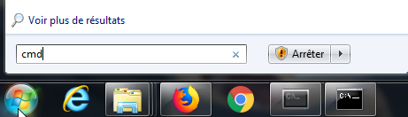

------------------------------------------------------------------------

### Installation de Python via miniconda

Copies d'écran sous Windows 7.

> [!IMPORTANT]
> C'est la façon d'installer que
> nous vous conseillons (les créateurs de Conda se chargent de la
> compilation de nombreux modules pour la version de Python installée et
> les rendent ainsi facilement installables).  
> Par contre, cette installation nécessite d'avoir une connexion à
> Internet correcte sur la machine cible et suffisament de place (plus de
> 3Go de libres pour être tranquille) — si ce n'est pas votre cas, il
> vaut mieux choisir l'installation via l'installeur de Python ci-après.
> 
> Si l'installation de conda occupe vraiment trop de place, vous pouvez
> essayer la commande `conda clean -a` pour supprimer tous les éléments
> qui ne sont plus utiles (anciennes versions… voir la 
> [doc conda clean](https://docs.conda.io/projects/conda/en/latest/commands/clean.html)
> pour un nettoyage plus ciblé). 

La société Continuum Analytics fournit Anaconda, qui est un regroupement
très volumineux de nombreuses librairies et applications pour utiliser
Python dans un cadre scientifique ou technique. Les logiciels et
librairies sont gérés avec un logiciel **conda** 
([documentation conda](https://conda.io/docs/)).

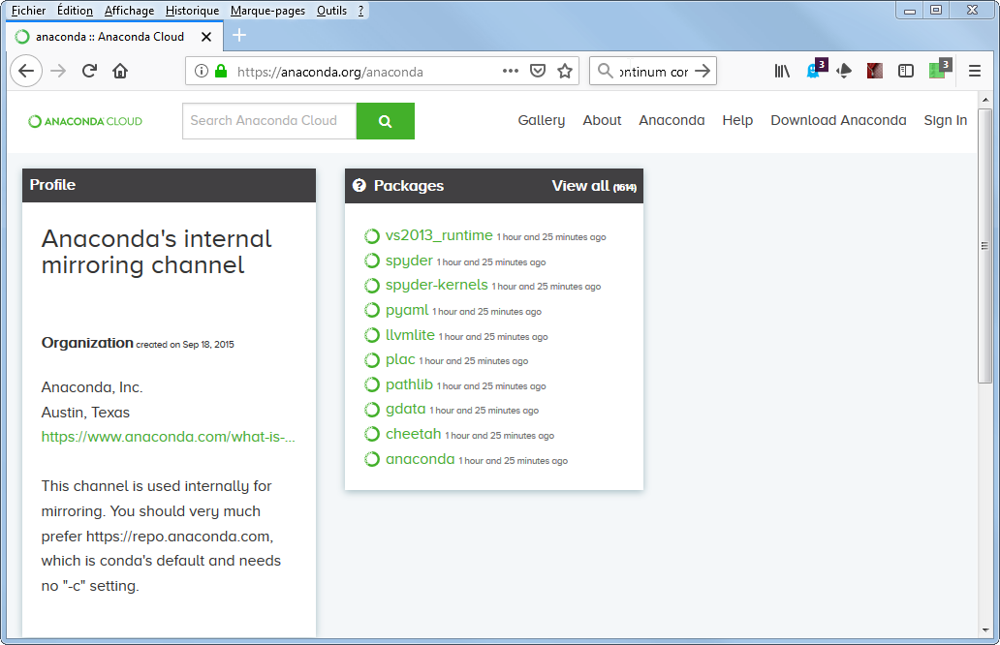

Ils fournissent une version plus réduite sous la forme de **Miniconda**,
disponible sur le site <https://conda.io/miniconda.html> . Veillez à
choisir l'installeur pour la dernière version de Python 3 et
correspondant à votre version de Windows (32 bits ou 64 bits).

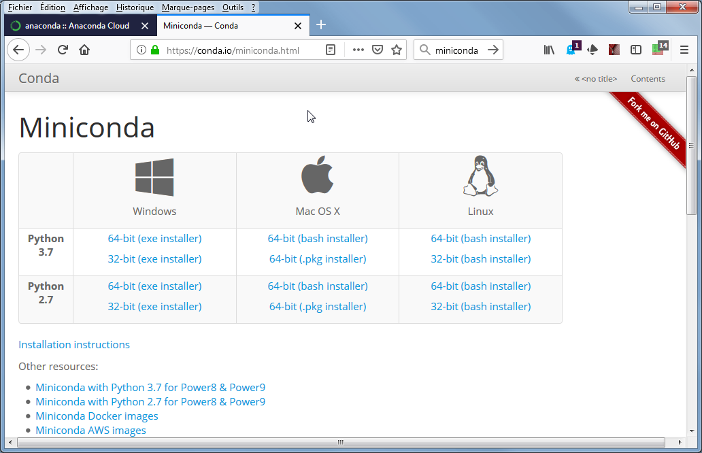

Une fois l'installeur téléchargé, lancez-le et autorisez son exécution
dans le message d'avertissement de sécurité.

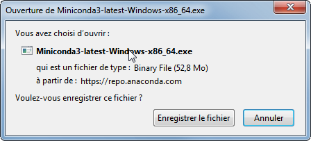

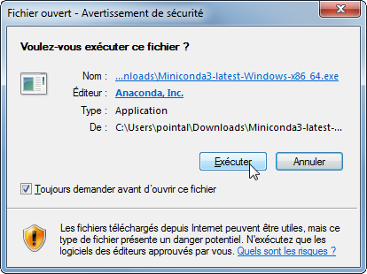

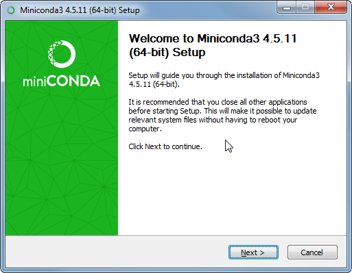

Acceptez la licence.

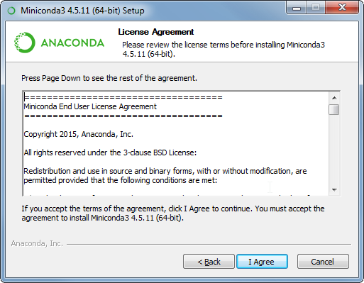

Pour faire simple, choisissez de l'installer juste pour vous (sinon, il
vous faut avoir des accès administrateur sur votre ordinateur).

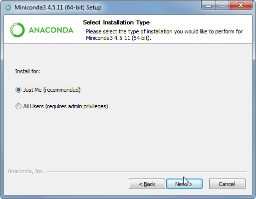

Vérifiez que le logiciel sera bien installé dans votre répertoire
personnel sous Windows (typiquement
`C:\Users\<votrelogin>\AppData\Local\Continuum\miniconda3`). Vous pouvez
éventuellement noter ce chemin d'accès, il pourrait être utile.

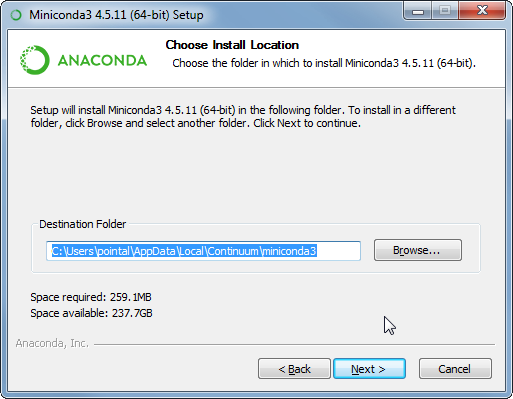

Pour les deux options d'installation (ajout d'Anaconda au PATH et
enregistrement d'Anaconda comme programme par défaut pour Python), vous
pouvez les laisser décochées.

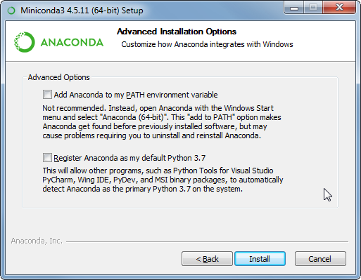

Une fois l'installation terminée, le dialogue final s'affiche (vous
pouvez, si vous le désirez, en apprendre plus sur Anaconda Cloud et sur
l'utilisation d'Anaconda).

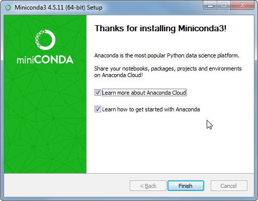

Notez que l'installation occupe déjà quasiment 400 Mio sur votre
disque.

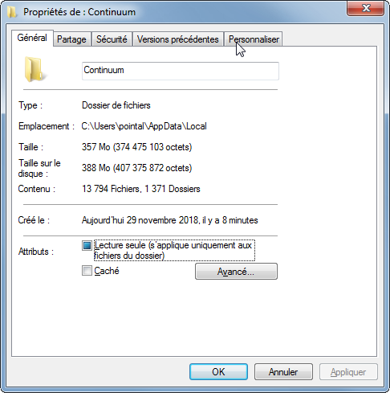

Votre menu programmes de Windows doit maintenant avoir une entrée
**Anaconda3**, contenant un lanceur **Anaconda Prompt**. C'est celui-ci
que vous allez utiliser pour poursuivre l'installation en utilisant
directement des commandes `conda …`.

#### Installation de matplotlib

> [!TIP]
> Si vous voulez installer **Pyzo** comme
> IDE pour travailler, alors vous pouvez commencer par l'installer et
> poursuivre ensuite l'installation des librairies directement dans
> l'environnement de Pyzo (avec les commandes conda… ou pip… sans
> avoir à ouvrir le prompt Anaconda).

Lancez Anaconda Prompt, et installez la bibliothèque `matplotlib` via
conda en saisissant la commande suivante :

    conda install matplotlib

Celui-ci va commencer par mettre à jour sa base de bibliothèques, puis
il va rechercher les dépendances et vous proposer d'installer toute une
série de packages, acceptez la proposition avec `y`. Cela va entre
autres vous installer la bibliothèque de calcul `numpy`.

Vous pouvez aussi installer la bibliothèque `mypy` (outil pour vérifier
les types dans les scripts Python) :

    conda install mypy

Notez que l'installation occupe déjà quasiment 3 Gio sur votre disque.

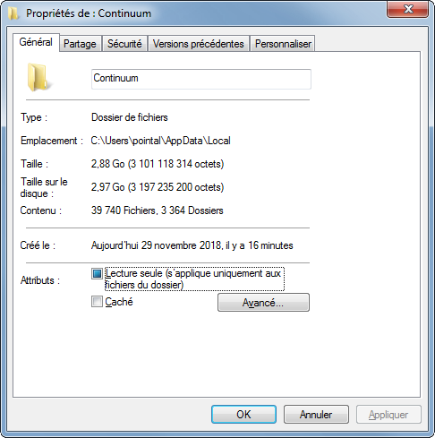

------------------------------------------------------------------------

### Installation de Python via l'installeur

> [!IMPORTANT]
> C'est l'installation à privilégier si vous n'avez pas beaucoup de place sur votre disque dur. 

Sur le [site officiel de Python](http://www.python.org/) allez sur la
page de [téléchargement pour Windows](https://www.python.org/downloads/windows/), et choisissez
l'installeur correspondant à votre version de Windows (*Windows x86
executable installer* pour Windows 32 bits, *Windows x86-64 executable
installer* pour Windows 64 bits).

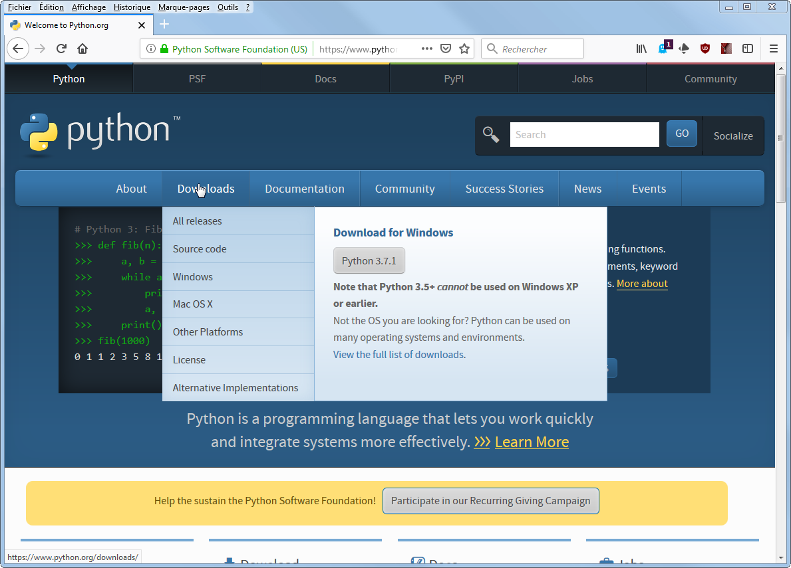

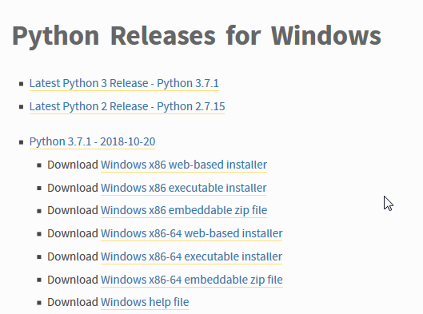

Une fois l'installeur téléchargé, lancez-le et autorisez son exécution
dans le message d'avertissement de sécurité.

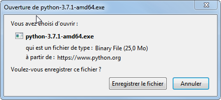

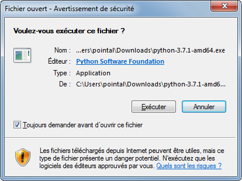

Pour faire simple, **décochez** les options _"Install launcher for all
users"_ et _"Add Python 3.x to PATH"_. Cela facilitera certaines
installations ultérieures de bibliothèques via `pip` :

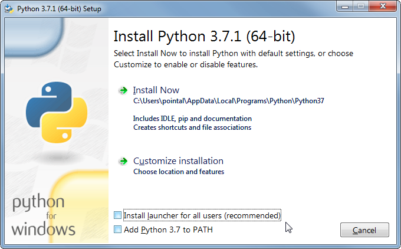

Avec ces options, Python sera installé dans
`C:\Users\<votrelogin>\AppData\Local\Programs\Python\Python3X`.

Si vous cliquez sur l'installation personnalisée (mais vous n'en avez
pas besoin), vous pourrez spécifier différentes options d'installation
(laissez les sélections par défaut comme ci-dessous).

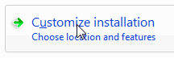

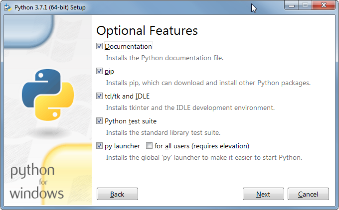

- **Documentation** installe localement la documentation Python, qui
  sera accessible par les menus.
- **pip** est un outil pour installer des bibliothèques
  supplémentaires (nous allons l'utiliser).
- **tcl/tk and IDLE** est l'environnement graphique de base avec un
  IDE pour Python.
- **Python test suite** peut éventuellement être désélectionné
  (scripts de tests que l'installation est correcte).
- **py launcher** permet d'installer un *adaptateur* qui se charge de
  lancer la bonne version de Python suivant les indications au début
  du script que l'on veut exécuter — peut être désélectionné, mais
  ne gène pas.
  - **for all users** pour installer py launcher pour tout le monde,
    nécessite des droits d'administration sur la machine.

Avant de lancer l'installation, l'installeur Python fait un petit
récapitulatif, cliquez sur *Install Now*… :

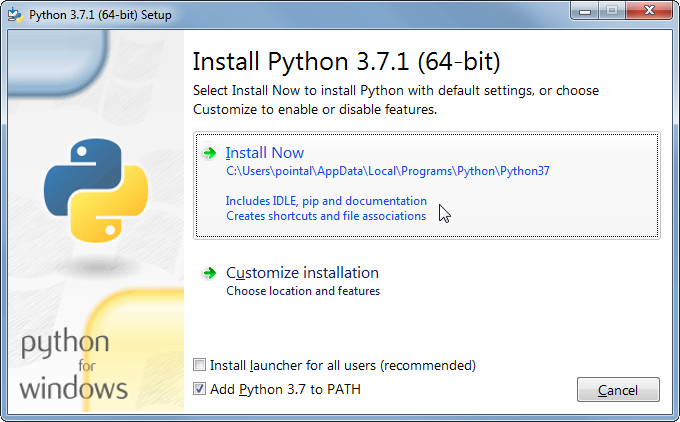

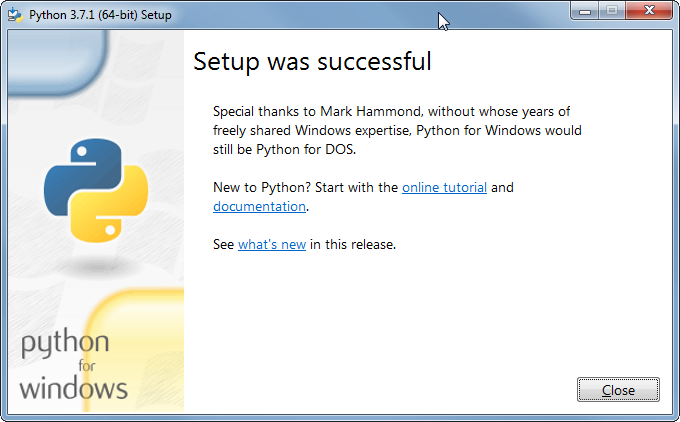

Après l'installation une nouvelle entrée a été ajoutée dans votre menu
de programmes.

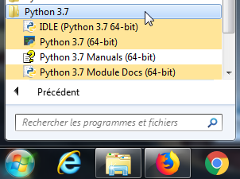

Ce menu contient des entrées pour accéder à la documentation, démarrer
l'IDE IDLE, ou encore démarrer une console Python.

Et si vous avez demandé l'installation de Python dans le PATH, alors
vous pouvez aussi le démarrer simplement via la console Windows.

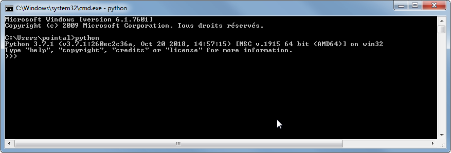

Cette installation de base occupe environ 190 Mio, bien plus réduite que
l'installation de base de conda (mais il y a moins de librairies).

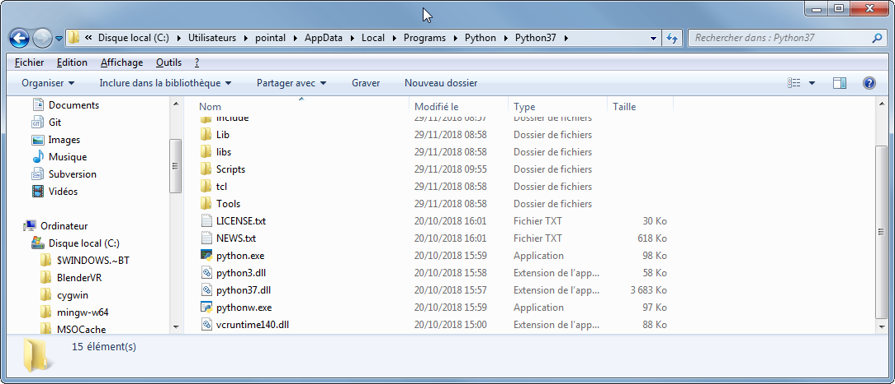

#### Installation de matplotlib

Nous allons simplement utiliser le système d'installation de librairies
(ou de *gestion de packages*) de Python avec l'outil `pip` qui utilise
le dépôt [Python Package Index (PyPI)](https://pypi.org/).

> [!TIP]
> Si vous avez coché l'option _"Add Python 3.X to PATH"_ lors de l'installation de Python, 
> vous pouvez directement saisir `python` sans spécifier le chemin d'accès complet.

Si vous voulez installer **Pyzo** comme IDE pour travailler, alors vous
pouvez commencer par l'installer et poursuivre ensuite l'installation
des librairies directement dans l'environnement de Pyzo (avec les
commandes `pip…` sans avoir à spécifier l'exécutable Python). \</WRAP\>

Ouvrez une console et installez `matplotlib` avec la ligne de commande
suivante (adaptez à votre chemin d'installation, login et n° de version
Python) :

    C:\Users\<votrelogin>\AppData\Local\Programs\Python\Python3X\python -m pip install -U matplotlib

L'outil va télécharger sur le site de dépôts la librairie demandée
ainsi que les dépendances nécessaires, puis les installer pour leur
usage avec l'exemplaire de Python utilisé pour leur installation. Cela
va entre autres vous installer la bibliothèque de calcul `numpy`.

Vous pouvez aussi installer la bibliothèque `mypy` (outil pour vérifier
les types dans les scripts Python) :

    C:\Users\<votrelogin>\AppData\Local\Programs\Python\Python3X\python -m pip install -U mypy

Avec ces librairies complémentaires, l'installation occupe un peu moins
de 200 Mio sur le disque.

------------------------------------------------------------------------

### Installation de Pyzo

Pyzo est un environnement de développement intégré (IDE) simple pour
Python, ciblant plus spécialement l'enseignement. Il offre quelques
outils pratiques permettant de découvrir le langage et la programmation
(naviguer dans le code, afficher les variables, exécuter le programme en
pas à pas…). Il fonctionne sur les trois plateformes les plus
courantes (Windows, MaxOS, Linux). Il permet d'utiliser au choix les
versions de Python installées avec l'installeur officiel ou bien avec
l'installeur conda (avec lequel il s'intègre bien) — il est même
possible de configurer plusieurs versions installées de Python et de
passer de l'une à l'autre.

Le site [Pyzo](https://pyzo.org/) offre un petit [guide d'utilisation
Pyzo](https://pyzo.org/guide.html).

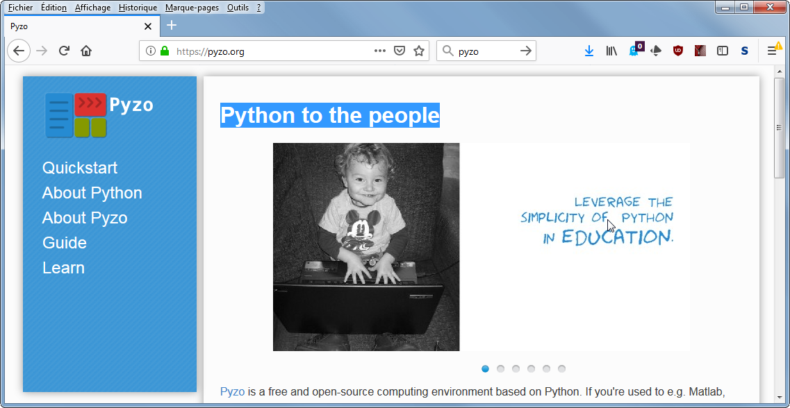

Téléchargez Pyzo pour votre système d'exploitation sur la page
<https://pyzo.org/start.html> :

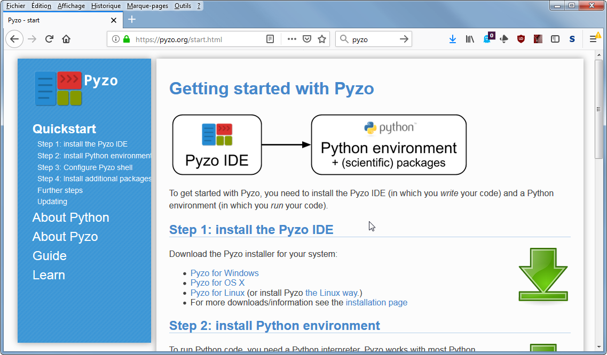

Par exemple pour windows, téléchargez puis démarrer l'installeur (sans
oublier de valider l'avertissement de sécurité) pour arriver au
dialogue d'installation :

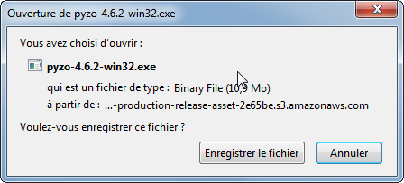

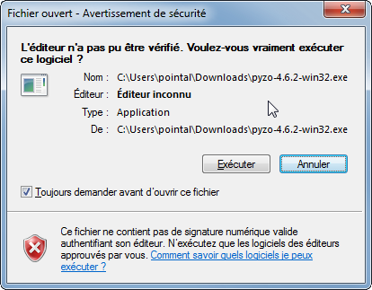

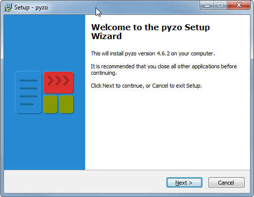

Si vous ne voulez pas faire une installation pour tout le monde,
modifiez l'emplacement d'installation  :

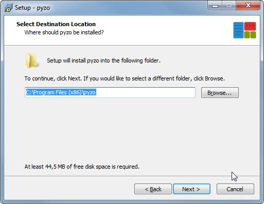

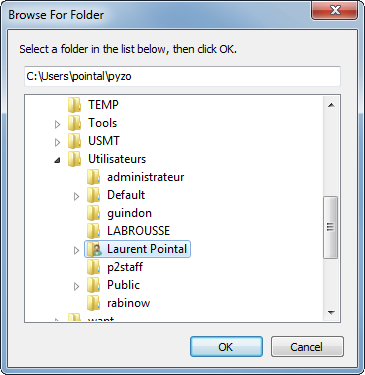

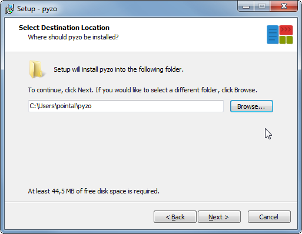

Dans les options complémentaires à l'installation, éventuellement
**décochez** *Associate ".py" extension* qui nécessite des droits
d'administration.

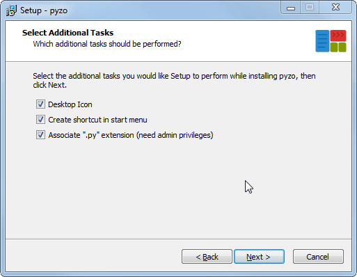

Avant de lancer l'installation, l'installeur Pyzo fait un petit
récapitulatif, validez et installez :

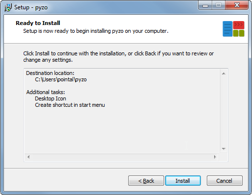

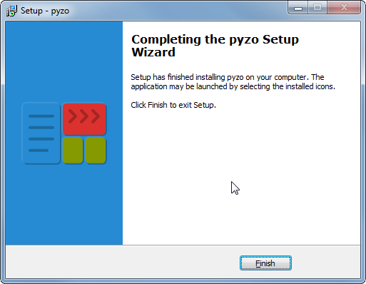

Sous Windows, après l'installation une nouvelle entrée a été ajoutée
dans votre menu de programmes.

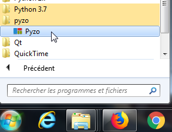

#### Configuration du shell Python de Pyzo

Au premier démarrage, Pyzo va rechercher les versions de Python
disponible — installation standard ou via conda — et dans un onglet
outil shell vous indiquer ce qu'il a pu trouver. Si une installation
via conda a été faite, il va la signaler en priorité.

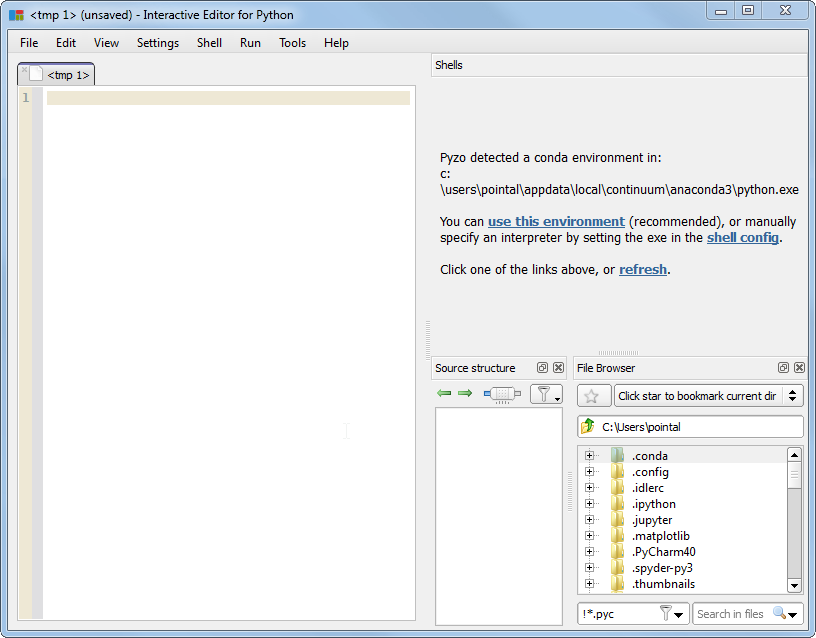

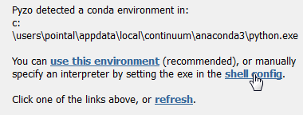

Si vous avez installé Python avec conda, cliquez simplement sur *use
this environment*, sinon cliquez sur *shell config* pour accéder au
dialogue de configuration des Shells (interpréteurs Python utilisables).

Le **dialogue de configuration des shells** (ici `Shell configurations`,
en anglais), permet de spécifier une ou plusieurs installations de
Python qui seront utilisables via Pyzo :

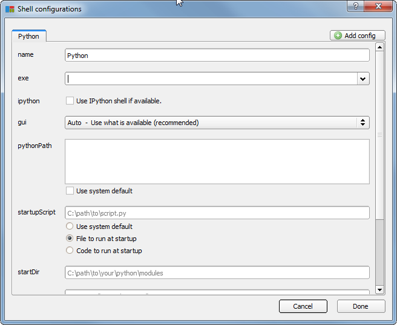

Il suffit de spécifier un **nom** pour une configuration de shell,
d'indiquer où est l'**exécutable Python** (via la flèche de menu Pyzo
permet de lister les installations de Python qu'il a détecté -
installations standard ou installation par conda), ainsi que de
spécifier diverses options pour le fonctionnement.

Exemple d'installations de Python détectées par Pyzo sur une machine :
une installation personnelle standard de Python 3.7.1, une installation
personnelle via conda de Python 3.6.5, ainsi qu'une installation
standard pour tout le monde de Python 2.7) :

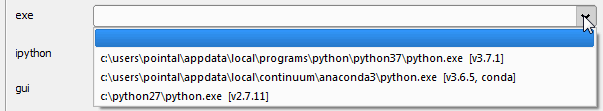

Sélectionnez le Python que vous avez installé pour les cours…

Lorsqu'un shell Python a été sélectionné, l'outil *Shells* de Pyzo
démarre une session interactive de Python avec la version sélectionnée.

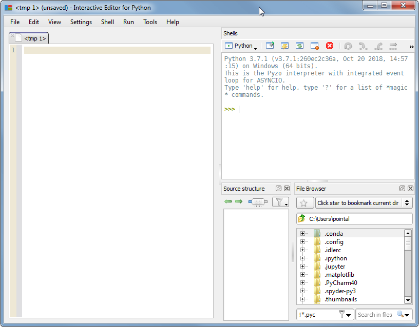

> [!TIP]
> Vous pouvez ultérieurement modifier/reconfigurer les shells Python utilisables 
> dans Pyzo en utilisant la commande de configuration accessible par le 
> menu *Shell*.

#### Configuration de Pyzo en français

Dans le menu *Settings*, sous-menu *Select language*, choisissez
*French*.

Redémarrez Pyzo, celui-ci utilise alors les menus en français (avec
parfois des items encore en anglais, lorsque la traduction est un peu en
retard sur l'évolution du logiciel) :

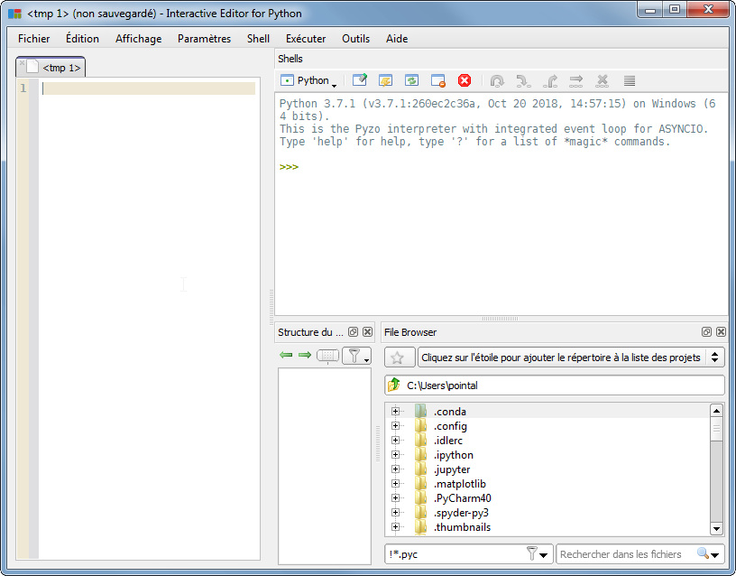

#### Outils de Pyzo

Le menu *Outils* de Pyzo permet d'activer plusieurs panneaux
d'outils :

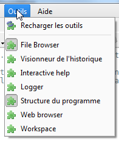

Parmi ces outils il est intéressant d'activer le **Workspace**, qui
permet de lister les *noms* définis dans l'environnement Python
(variables, fonctions…) ainsi que d'afficher les *valeurs* associées
et leur *type*.

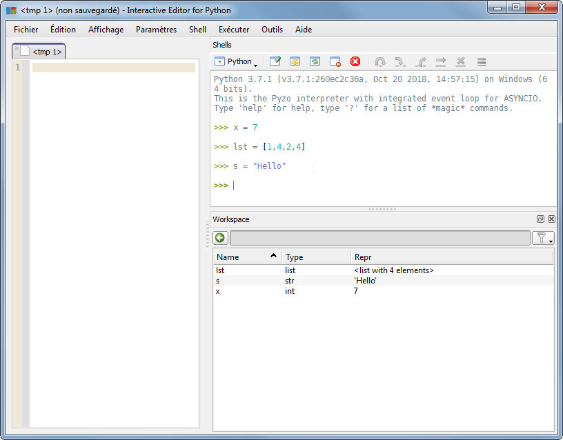

Sous Windows, l'installation de Pyzo occupe environ 47 Mio sur le
disque dur.

#### Pip et conda dans Pyzo

Lorsque vous utilisez un shell Python dans Pyzo, celui-ci rend les
commandes `conda` (si le shell Python a été installé via conda) et `pip`
directement accessibles via ce shell, il n'y a plus besoin d'ouvrir
une console séparée pour installer des librairies supplémentaires. Vous
pouvez essayer :

    pip list

et/ou

    conda list

> [!TIP]
> L'installation de Pyzo (et PySide pour l'interface graphique Qt) à partir 
> de `pip` échoue avec Python 3.7 car le PySide disponible en ligne par ce 
> moyen n'est à ce jour compatible que jusqu'à Python 3.4.  
> On passe donc par une installation avec l'installeur fourni sur le site
> de Pyzo, qui intègre directement la version de Python ainsi que les
> librairies nécessaires.

------------------------------------------------------------------------

## Mac OS

### Installation de Python via miniconda

La société Continuum Analytics fournit Anaconda, qui est un regroupement
très volumineux de nombreuses librairies et applications pour utiliser
Python dans un cadre scientifique ou technique. Les logiciels et
librairies sont gérés avec un logiciel **conda** 
([documentation conda](https://conda.io/docs/)).

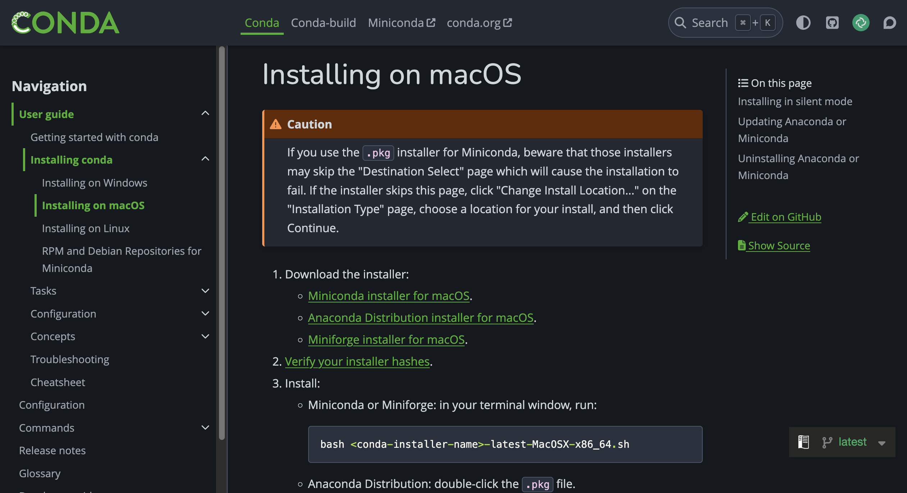

[Guide d'installation sur MacOS](https://conda.io/projects/conda/en/latest/user-guide/install/macos.html)

Ils fournissent une version plus réduite sous la forme de Miniconda,
disponible sur le site <https://conda.io/miniconda.html> . Veillez à
choisir l'installeur pour la dernière version de Python 3 et
correspondant à votre version de MacOS (système, plateforme matérielle).

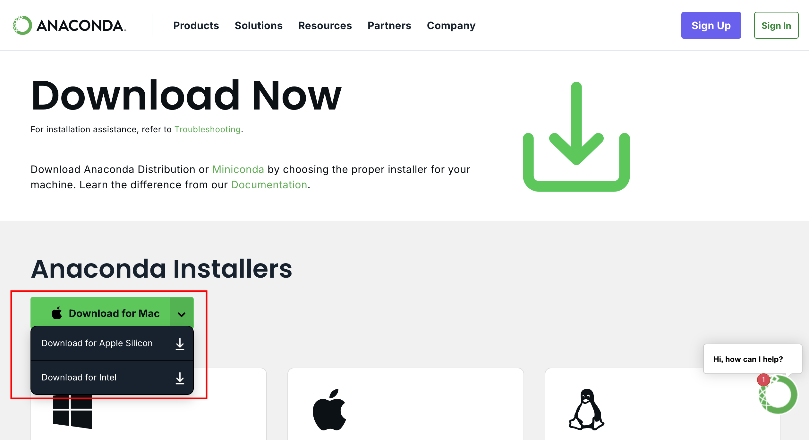

Si vous avez choisi Anaconda, il fournit de nombreux logiciels
permettant de travailler avec Python, dont Jupyter.

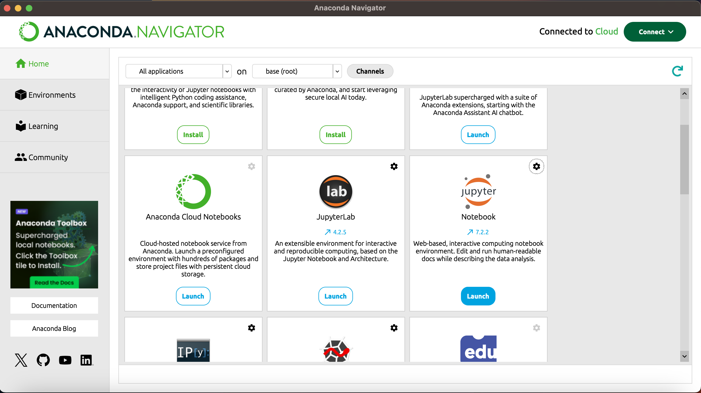

En lançant Jupyter vous pouvez naviguer jusqu'à l'endroit où vous avez
téléchargé les fichiers liés au livre et les ouvrir.

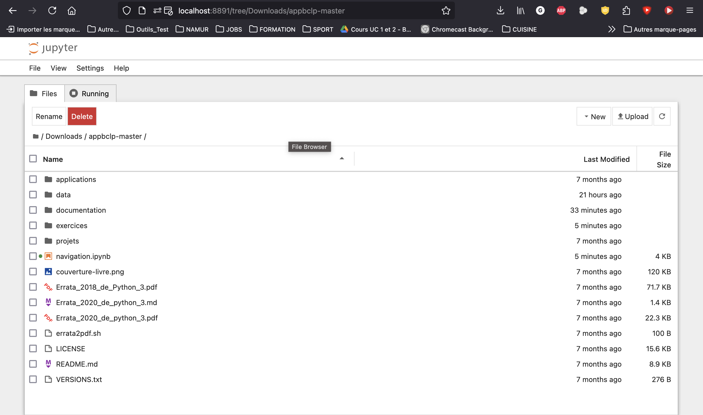

*Merci à David Grivel pour les copies d'écran.*

------------------------------------------------------------------------

## Linux

### Connaître votre système Linux

Dans une console, faites afficher le fichier `/etc/os-release`. Par
exemple :

    laurent@litchi:~$ cat /etc/os-release 
    NAME="Ubuntu"
    VERSION="19.10 (Eoan Ermine)"
    ID=ubuntu
    ID_LIKE=debian
    PRETTY_NAME="Ubuntu 19.10"
    VERSION_ID="19.10"
    HOME_URL="https://www.ubuntu.com/"
    SUPPORT_URL="https://help.ubuntu.com/"
    BUG_REPORT_URL="https://bugs.launchpad.net/ubuntu/"
    PRIVACY_POLICY_URL="https://www.ubuntu.com/legal/terms-and-policies/privacy-policy"
    VERSION_CODENAME=eoan
    UBUNTU_CODENAME=eoan

(si le fichier d'informations os-release n'existe pas sur votre
ordinateur, vous pouvez essayer avec `redhat-release`, `SuSE-release`,
`mandrake-release`, `lsb-release`, `debian_version`…) Cela vous
indique la distribution Linux qui est installée ainsi que la version de
cette distribution.

De plus, dans une console, faites afficher les informations sur le
système avec `uname` :

    laurent@litchi:~$ uname -a
    Linux litchi.pointalnet.home 5.3.0-29-generic #31-Ubuntu SMP Fri Jan 17 17:27:26 UTC 2020 x86_64 x86_64 x86_64 GNU/Linux

Cela vous précise si vous êtes en 32 bits (x86 seul) ou bien en 64 bits
(x86_64). Si vous êtes sur une machine plus exotique qu'un PC standard,
vous pouvez avoir d'autres indication que x86 (processeurs compatibles
avec la famille Intel x86).

------------------------------------------------------------------------

### Installation de Python avec le gestionnaire de paquets

> [!IMPORTANT]
> Cette façon de faire implique que vous avez les **droits d'administration** 
> sur votre ordinateur. Si ce n'est pas le cas, passez à une installation par 
Miniconda (ci-après).

Le plus simple pour installer Python 3 avec un système Linux est
d'utiliser le **gestionnaire de paquets** de votre plateforme, soit via
une interface graphique, soit via la ligne de commandes : `apt` pour
Debian/Ubuntu et dérivées, `rpm` pour RedHat/Fedora/Mandriva et
dérivées, `pacman` pour Arch, `zypper` pour OpenSUSE, `portage` pour
Gentoo… **consultez la documentation de votre distribution Linux pour
les explications sur ces commandes**.

> [!IMPORTANT]
> Si la version de Python 3 fournie en standard par votre distribution Linux 
> est trop ancienne, la solution la plus simple est de passer à une installation 
> par Miniconda (ci-après).

Il n'est pas impossible que la version ainsi fournie soit antérieure à
**Python 3.6**. Pour le vérifier, lancez la commande `python3` dans une
console, Python va démarrer et vous afficher le n° de version (Ctrl-D
pour sortir). Par exemple avec une machine sous Ubuntu 16.04 il va
falloir faire une installation spécifique de Python, car on obtiens :

    pointal@motus:~$ python3
    Python 3.5.2 (default, Nov 12 2018, 13:43:14) 
    [GCC 5.4.0 20160609] on linux
    Type "help", "copyright", "credits" or "license" for more information.
    >>>

Alors qu'avec une machine sous Ubuntu 18.04 la version standard de
Python 3 est suffisante pour notre usage :

    laurent@litchi:~$ python3
    Python 3.6.7 (default, Oct 22 2018, 11:32:17) 
    [GCC 8.2.0] on linux
    Type "help", "copyright", "credits" or "license" for more information.
    >>>

> [!ALERT]
> **Il ne faut pas installer avec `pip` des librairies Python à la place de 
> celles fournies par votre distribution Linux**.
> 
> Les empaqueteurs ont fait un travail sur ces librairies afin que leurs
> versions soient cohérentes entre elles et que votre système soit
> fonctionnel. Écraser ces librairies avec d'autres versions risque de
>casser cette cohérence et de rendre votre système instable ou
> inutilisable.  
> Donc, pas de ~~`sudo pip install trucmachin`~~.

> [!IMPORTANT]
> Du **danger d'installer des librairies utilisateurs par défaut** 
> (pip install \--user)
> 
> Lorsqu'on lance des scripts écrits en Python, celui-ci utilise une
> variable d'environnement, le `PYTHONPATH` dont l'usage est similaire
> au `PATH` : il contient la liste des répertoires dans lesquels Python va
> chercher les librairies (modules) lors des imports. En Python on accède
> à cette liste via la globale `sys.path`.  
> Dans cette liste de répertoires figure, généralement au début, un
> répertoire personnel dans lequel peuvent être installées des librairies
> pour votre seul usage. Ce répertoire est utilisé à l'installation
> d'une librairie soit lorsqu'on indique l'option `pip install --user`,
> soit lorsque pip détecte qu'il ne peut pas écrire dans les répertoires
> réservés du système (ce qui est une bonne chose).
> 
>     >>> import sys, pprint as pp
>     >>> pp.pprint(sys.path)
>     ['',
>      '/usr/lib/python35.zip',
>      '/usr/lib/python3.5',
>      '/usr/lib/python3.5/plat-x86_64-linux-gnu',
>      '/usr/lib/python3.5/lib-dynload',
>      '/home/monlogin/.local/lib/python3.5/site-packages',
>      '/usr/local/lib/python3.5/dist-packages',
>      '/usr/lib/python3/dist-packages']
>
> Typiquement, dans l'exemple ci-dessus le *site-packages* de
> l'utilisateur est listé avant le *dist-packages* du système… les
> librairies installées de façon privée pour l'utilisateur sont donc
> utilisées prioritairement par rapport aux librairies fournies par le
> système. Les scripts que vous lancez vont prioritairement trouver et
> charger les librairies qui ont été installées pour votre seul usage dans
> votre répertoire personnel, il y a alors de forts risques que les
> versions installées ne soient pas compatibles et que les scripts
> génèrent des erreurs lors de leur exécution.
> 
> Il vaut donc mieux mettre en place des **environnements virtuels
> Python**, soit [avec conda](https://conda.io/docs/user-guide/tasks/manage-environments.html),
> soit [avec virtualenv](https://virtualenv.pypa.io/en/latest/) (et
> [virtualenvwrapper](https://virtualenvwrapper.readthedocs.io/en/latest/index.html))
> ([article Sam&Max sur virtualenv](http://sametmax.com/les-environnement-virtuels-python-virtualenv-et-virtualenvwrapper/)).  
> Note: Depuis la rédaction de cette page, l'outil de plus en plus conseillé est **uv**
> de la société Astral (outil très rapide, permettant de remplacer les outils
> de gestion d'environnement virtuels et d'installation de paquets Python)
> [docs uv](https://docs.astral.sh/uv/).  
> Et ensuite activer ces environnements au besoin suivant les projets que
> l'on développe.

#### Installation de matplotlib

Si la bonne version de Python est packagée, il est très probable que les
librairies que nous utilisons le soient aussi. Toujours avec le
gestionnaire de package, installez les librairies `matplotlib` et `mypy`
pour Python 3 (elles ont souvent des noms comme `python3-matplotlib`,
pour les distinguer des librairies de Python 2).

------------------------------------------------------------------------

### Installation de Python avec Miniconda

Il faut commencer par [télécharger Miniconda](https://docs.conda.io/en/latest/miniconda.html#linux-installers)
pour Linux, en sélectionnant l'installeur version Python 3.x, pour la
plateforme 32 ou 64 bits suivant votre système d'exploitation.

Une fois celui-ci disponible, les [instructions d'installation](https://conda.io/projects/conda/en/latest/user-guide/install/linux.html)
indiquent d'ouvrir un terminal et de lancer
`bash Miniconda3-latest-Linux-x86_64.sh`. Il suffit ensuite de suivre
les instructions.

TODO: Précision sur le répertoire d'installation et l'intégration dans
le shell.

Pour désactiver l'environnement `base` de conda au démarrage des
sessions shell, il suffit de le reparamétrer avec la commande:

    conda config --set auto_activate_base false

------------------------------------------------------------------------

## Installation de Pyzo

Il est possible de simplement télécharger l'archive compressée pour
Linux, via le lien sur la page 
[Getting started with Pyzo](https://pyzo.org/start.html) (actuellement
pyzo-4.7.3-linux64.tar.gz). Votre environnement de travail doit vous
permettre d'ouvrir et décompresser le contenu de ce fichier que vous
pouvez installer où vous voulez. Il suffit ensuite d'ouvrir
l'application `pyzo` contenue dans le répertoire d'installation.

Ou sinon, suivre les indications 
[Install Pyzo on Linux](https://pyzo.org/install_linux.html) qui fait installer les
paquets du système dont dépend Pyzo, puis utilise pip pour installer la
dernière version de Pyzo (note: installation sudo + pip au niveau du
systèmz, voir les risques indiqués précédement). Ou encore suivre les
indications sur [Pyzo - install](https://pyzo.org/install.html).

Note: la version actuelle (4.6.1) de Pyzo fournie sous la forme d'un
fichier compressé d'archive a un 
[problème connu avec Ubuntu 18.04](https://github.com/pyzo/pyzo/issues/546), pour le résoudre il
suffit de supprimer le fichier `pyzo-4.6.1/lib/libz.so.1` fourni dans
l'archive (la librairie fournie par le système est alors normalement
utilisée).

========================================================================

## Pour finir…

> [!TIP]
> En mesures physiques à l'IUT d'Orsay, nous ne disposons pas pour le 
> moment de [Jupyter Notebook](http://jupyter.org/), qui permet de fournir 
> un accès à Python via une interface web, de partager des documents 
> (les notebooks) mélangeant code, texte, images, formules… — un peu 
> comme des espaces multimédia de rédaction et programmation. 
> C'est un bon outil pour apprendre les bases et partager des documents 
> complets, des exercices, etc.  
> Chez vous, Jupyter Notebook peut être facilement installé via conda.  
> (pub) *Voir le livre co-rédigé avec B.Cordeau et édité dans la
> collection InfoSup chez Dunod : 
> [Python 3 -- Apprendre à Programmer dans
> l'écosystème Python](https://www.dunod.com/sciences-techniques/python-3-apprendre-programmer-dans-ecosysteme-python-0)*.

